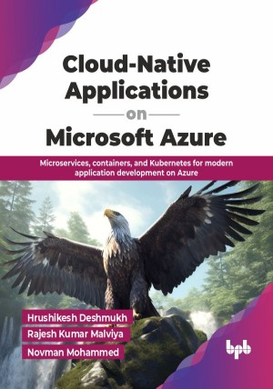

# Cloud-Native Applications on Microsoft Azure

Microservices, containers, and Kubernetes for modern application development on Azure.

This is the repository for [Cloud-Native Applications on Microsoft Azure
](https://bpbonline.com/products/cloud-native-applications-on-microsoft-azure?variant=44849505861832),published by BPB Publications.

## About the Book
Cloud-native technologies are at the core of enterprise transformation, enabling applications that are scalable, resilient, and intelligent. Microsoft Azure offers a comprehensive platform to architect, automate, and future-proof these next-generation systems.

This book provides a step-by-step journey through cloud-native design on Azure, starting with the fundamentals and addressing real-world challenges. You will explore the differences between cloud-native and microservices, learn how to leverage Azure’s native capabilities, and design robust architectures that incorporate networking, data management, and API-driven patterns. Hands-on chapters guide you through CI/CD pipelines, observability, governance, and security, using tools such as Azure DevOps, Terraform, Azure Monitor, and Key Vault. This book also discusses AI and ML integration with Azure Machine Learning, Cognitive Services, and OpenAI, while gaining insights into future trends like edge computing, 5G, and service mesh. It concludes with five in-depth case studies across industries, such as retail, media, logistics, e-commerce, and healthcare, demonstrating how cloud-native principles translate into practical, high-impact solutions. 

By the end of this book, you will be equipped to design, build, secure, and manage enterprise-scale cloud-native applications on Microsoft Azure. From addressing challenges to applying best practices, from automation to observability, and from security to AI-driven innovation, this book takes you step-by-step through the entire lifecycle.

## What You Will Learn
• Understand cloud-native foundations and the challenges organizations face when transitioning. 

• Design end-to-end cloud-native architectures using modular, resilient, and scalable patterns. 

• Implement secure and performant networking with VNets, Load Balancers, and service mesh. 

• Manage distributed data with Cosmos DB, Azure SQL, and advanced data strategies. 

• Implement observability using Azure Monitor, Application Insights, and OpenTelemetry.

• Automate CI/CD and infrastructure with Azure DevOps, GitOps, Terraform, and ARM templates. 
